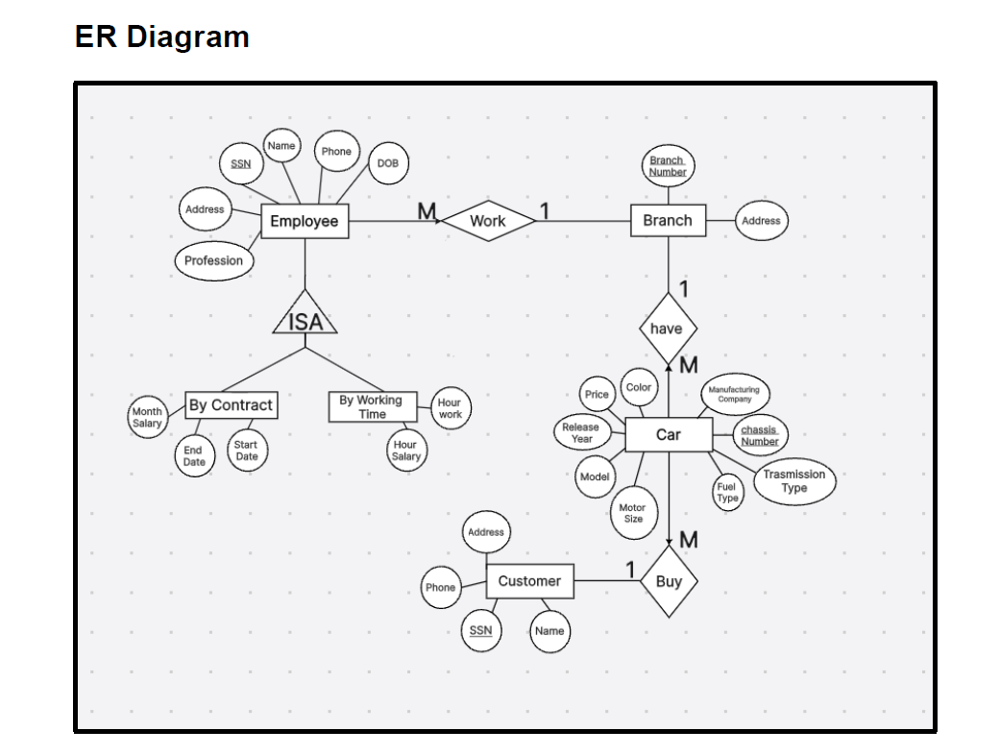

# 🚗 Car Showroom Management System

The **Car Showroom Management System** is a database-driven project designed to manage cars, customers, employees, and branches efficiently.  
It provides SQL scripts for creating and managing tables, inserting sample data, and running queries to simulate a real-world showroom database.  

---

## ✨ Features
- 📋 **Car Management**: Add, update, and delete car details (model, brand, price, availability).  
- 👥 **Customer Management**: Record and manage customer information.  
- 💰 **Sales Transactions**: Track car ownership and sales details.  
- 🏢 **Branch Management**: Organize cars and employees by branch.  
- 👨‍💼 **Employee Management**: Manage employees with two types of contracts:  
  - **WorksByContract** → monthly salary, start/end date  
  - **ByWorkingTime** → hourly salary and work hours  

---

## 🧰 Tech Stack
- **Database:** MySQL  
- **Language:** SQL  
- **Tools:** MySQL Workbench / phpMyAdmin  
- **Design:** ERD, relational schema  

---

## 🗄️ Database Design (ERD)

### 📌 ERD Diagram
**PNG version (default):**  

---

## ▶️ How to Run
1. Install a SQL database system (e.g., MySQL).  
2. Open **`Car_showroom.sql`** in MySQL Workbench.  
3. Run the script to create the database, tables, and sample data.  
4. Use queries (`SELECT`, `INSERT`, `UPDATE`, `DELETE`) to interact with the system.  

---

## 📄 About
This project was developed as part of a **Database Systems course**.  
It demonstrates how relational databases can be applied to manage car showroom operations effectively.  

